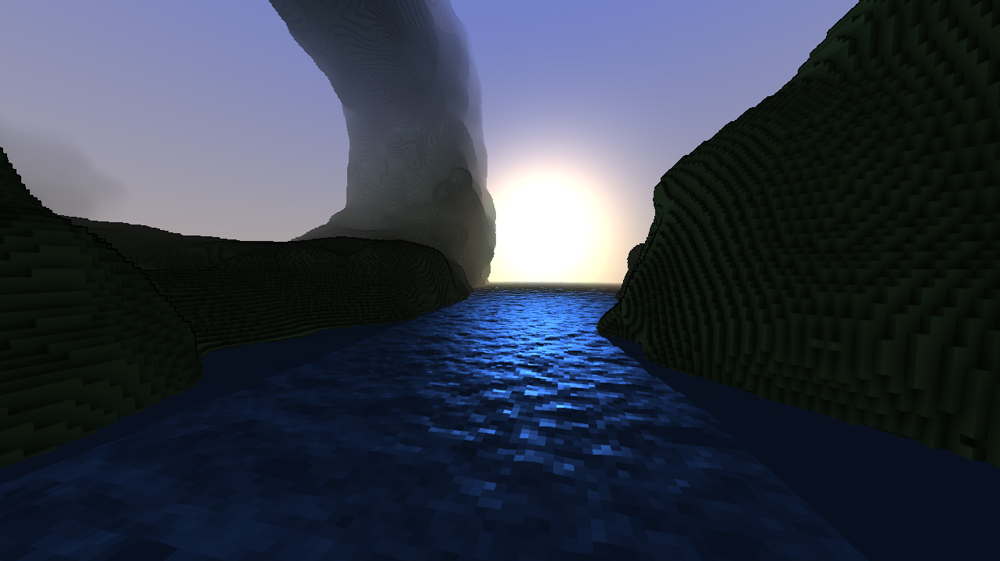
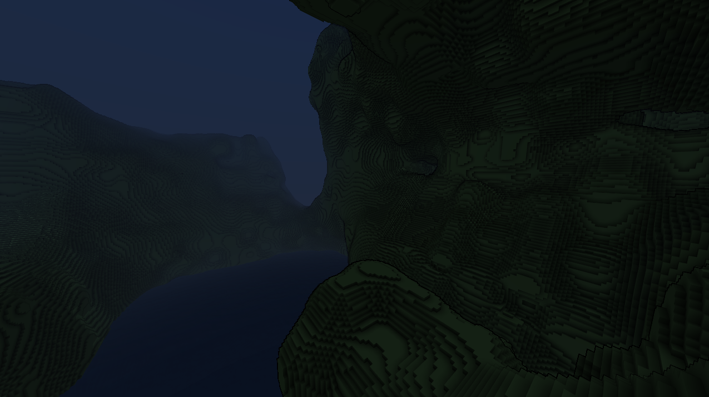
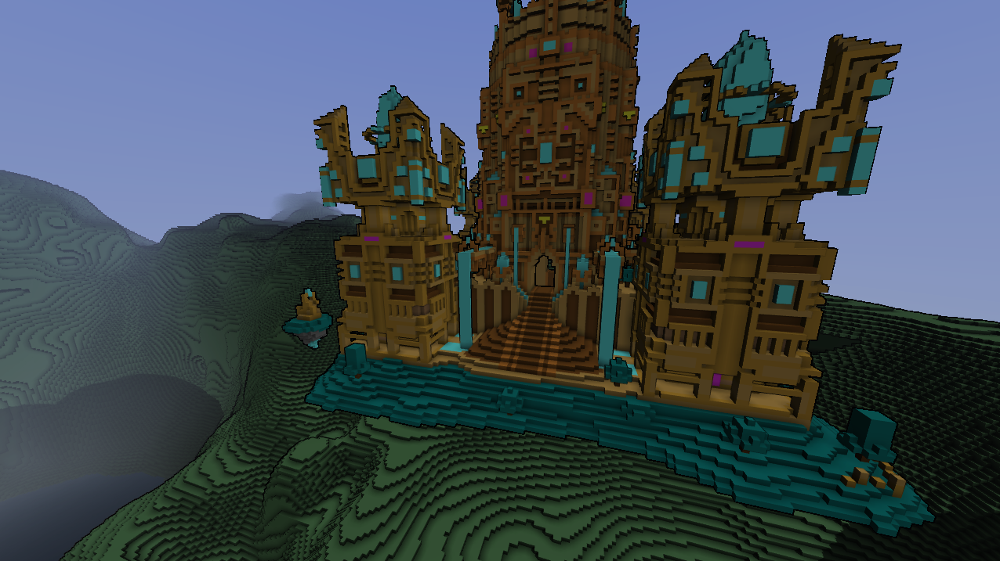

# Voxel Game

A prototype of a voxel game that I wrote several years ago in C++.
It uses my own engine, [Veletrix](https://github.com/Pikaju/Veletrix).
Videos can be found [on my YouTube channel](https://www.youtube.com/watch?v=icHgtmwPM0A).

## Features

* Procedural voxel generation using Perlin Noise
* Dynamic fog depending on the loaded chunks
* Day and night, with a sun and atmosphere shading
* Dynamic, cascaded shadow mapping
* Post processing effects like motion blur
* Animated water with specular reflections from the sun
* Model importing from MagicaVoxel
* Procedural tree generation algorithm
* Greedy meshing to reduce the number of triangles rendered
* Basic GUI elements
* Bird sounds

## Screenshots

